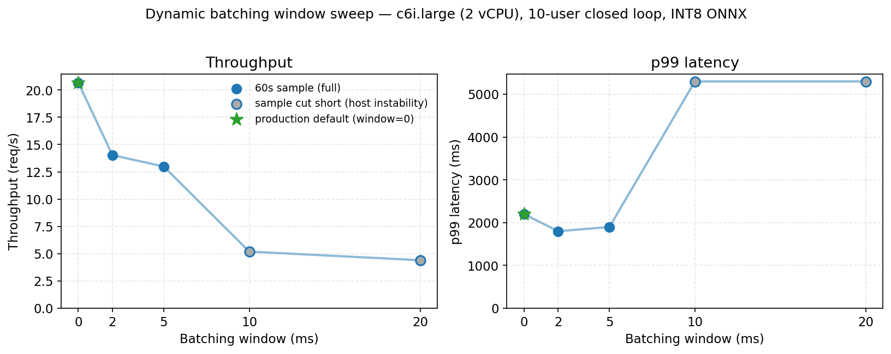
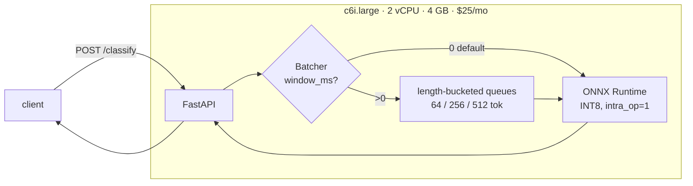

# moderation-engine

> Low-latency toxicity classification for real-time chat, optimized for CPU.


-orange)


A FastAPI service that wraps `unitary/toxic-bert` (BERT-base, 6 labels) and runs on a $25/month AWS box. I built it end-to-end as a portfolio MLE project. The path was: naive PyTorch baseline, then ONNX, then INT8, then length-bucketed dynamic batching, then an ORT threading tweak, then an INT4 long shot that I knew might fail (it did), and finally an identity-disaggregated bias eval.

## Headline numbers

Same hardware (`c6i.large`, 2 vCPU, $25/mo), same locked benchmark protocol (Phase 1, see [`docs/benchmarks.md`](docs/benchmarks.md)):

| Metric | Naive baseline | Final (INT8 + ORT tune) | Change |
|---|---:|---:|---:|
| p99 latency @ 1 user | 860 ms | ~400 ms | **-54%** |
| p99 latency @ 10 users | 4,800 ms | 2,000 ms | **-58%** |
| Throughput @ 10 users | 7.0 req/s | **23.6 req/s** | **+237%** |
| Container size | 873 MB | 173 MB | **-80%** |
| Macro-F1 (Jigsaw) | 0.6101 | **0.6146** | +0.0045 |

Macro-F1 actually went up under INT8, which cuts against the usual "quantization costs you accuracy" story. The full breakdown of why precision went up on 5 of 6 labels while recall went down is in [`docs/benchmarks.md`](docs/benchmarks.md#int8-accuracy-phase-2-opt-2).

### The chart (Phase 2 Opt 3: batching window sweep)



Bypass mode (`window=0`) wins on throughput, which is the axis that saturates this 2-vCPU host. p99 does nudge down at `window=2` (1,800 ms vs 2,200 ms), but throughput drops 32% to buy you that. The optimization that actually mattered wasn't the batcher at all. It was the one-line ORT threading knob from Opt 4 (`intra_op_num_threads=1`).

## Quick start

```bash
docker compose up                 # builds the image, boots on :8000
curl http://localhost:8000/health # {"status":"ok","model_loaded":true}
curl -X POST http://localhost:8000/classify \
  -H 'Content-Type: application/json' \
  -d '{"text":"I love this!"}'
# {"labels":{"toxic":0.0007,...},"model_version":"unitary/toxic-bert@onnx-int8"}
```

First boot takes about 30 seconds because the model loads into memory once at startup. The image is multi-stage and the INT8-quantized ONNX export gets baked in at build time, so the runtime never has to fetch from Hugging Face and works offline (`TRANSFORMERS_OFFLINE=1`).

## Architecture



The batcher lives in the tree but it's disabled by default. The EC2 sweep showed that bypass wins on a 2-vCPU host because ORT's intra-op threads already saturate both cores at batch=1. Flipping `BATCHING_WINDOW_MS=5` turns the bucketed path back on for instances with more vCPUs.

## Optimization journey

This is really the headline artifact of the project. Every row below was measured under the locked Phase 1 protocol (closed-loop locust sweep at 1/5/10/25/50/100 users for 60s each, on `c6i.large`, against the same 1000-row Jigsaw sample).

| Stage | p99 @ 1u/10u (ms) | Throughput @ 10u (req/s) | Macro-F1 | Container |
|---|---:|---:|---:|---:|
| Baseline (PyTorch CPU) | 860 / 4,800 | 7.0 | 0.6101 | 873 MB |
| + ONNX Runtime | 930 / 7,300 | 8-9 | 0.6101 | 521 MB |
| + INT8 dynamic quant | 430 / 3,100 | 22-23 | **0.6146** | 173 MB |
| + Dynamic batching (bucketed) | bypass wins | 20-21 (w=0) | 0.6146 | 173 MB |
| + ORT threading tune (`intra_op=1`) | ~400 / **2,000** | **23.6** | 0.6146 | 173 MB |
| Long shot, INT4 NF4 (failed) | bs=1 = 47.7 ms (11x slower) | 25.3 samples/s eval | 0.6127 | 146 MB |

### Opt 1: ONNX Runtime (lossless)

I exported PyTorch to ONNX with `optimum` and served it via `onnxruntime`. Parity vs PyTorch was tight: max absolute probability difference of 3.76e-06 across 63,978 Jigsaw rows times 6 labels. p50 dropped 25% and throughput went up 30%.

The surprise: p99 actually got worse at mid concurrency (+90% at 25 users). The reason is that ORT defaults `intra_op_num_threads` to the number of cores, so one inference grabs both vCPUs for itself. That's great for p50 with a single user, but it's bad for p99 once you have concurrent requests. This foreshadows Opt 4.

### Opt 2: INT8 dynamic quantization (the big win)

`onnxruntime.quantization.quantize_dynamic(QuantType.QInt8)`, weights only, no calibration data needed. p50 dropped 50 to 66% across the curve, throughput went up 120 to 191%, and the container shrank from 521 MB to 173 MB. Macro-F1 actually went up by 0.0045 (5 of 6 labels improved).

Why did F1 go up? Precision up and recall down on every label. INT8 mildly compresses logits toward zero, and the FP32 baseline was precision-limited at threshold 0.5. The tradeoff happened to land on the right side of the bias/variance curve for this baseline. Full breakdown is in [`docs/benchmarks.md`](docs/benchmarks.md#int8-accuracy-phase-2-opt-2).

One hardware tangent worth knowing about: the eval almost didn't happen on Colab T4. ORT has no CUDA kernel for `MatMulInteger` or `DynamicQuantizeLinear`, so the whole graph fell back per-op to CPU with bus copies (13 hour estimate). Colab CPU was even worse since the free-tier Xeons predate AVX-VNNI and have no INT8 SIMD. I ended up running it locally on an M3 Pro (ARM SDOT) instead. A quantization format is only as fast as the SIMD that supports it, and this lesson comes back hard in the INT4 long shot below.

### Opt 3: Length-bucketed dynamic batching (built, measured, bypass wins)

I wrote the `asyncio` batcher from scratch in [`moderation_engine/batcher.py`](moderation_engine/batcher.py). I didn't use `mosec` or `litserve` because the point was to learn the failure modes myself.

Round 1 was naive single-queue batching, and it collapsed throughput by 4x because Jigsaw's seq_len is heavy-tailed (p99 = 512 tokens) and `padding=True` makes every batch pay the longest-item compute cost.

Round 2 routed requests into `[64, 256, 512]` buckets sized against the actual 58/37/5 traffic split. That recovered most of the loss (5.4 to 14 req/s), but bypass still won at 20.7 req/s. The reason is that ORT defaults to 2 intra-op threads on a 2-vCPU host, so a single inference already pegs both cores. Batching just adds queueing time without adding compute capacity.

So the deliverable isn't "I shipped batching." It's the curve in [`docs/charts/batching_window_sweep.png`](docs/charts/batching_window_sweep.png) and the diagnosis: why naive batching failed (padding), what fixed it (bucketing), and why even the fix can't beat bypass on 2 vCPUs (intra-op saturation). The code stays in the tree behind `BATCHING_WINDOW_MS` for the multi-vCPU case where it would flip positive.

### Opt 4: One-line ORT threading knob (the surprise winner)

`SessionOptions.intra_op_num_threads = 1`. One line. +7.4% throughput over the INT8 baseline at 10 users. Two single-threaded inferences run truly in parallel on the two vCPUs instead of fighting over shared intra-op threads. It's basically the Opt 1 diagnosis read in reverse.

The interaction is interesting: `intra_op=1` is a Pareto win in bypass mode, but it loses when combined with the batcher (-25% vs either bypass row). Per-bucket batches give up the intra-op parallelism that bypass gets to keep. Optimizations don't always stack cleanly, so you have to evaluate the combination instead of just the deltas.

### Long shot: INT4 NF4 quantization (the deliberate failure)

The hypothesis was: if INT8 halved the size and tripled the speed, INT4 should at least shrink the container further at the same latency. I wrapped `MatMulBnb4Quantizer(quant_type=NF4)` over the FP32 export.

I'd predicted three failure modes and all three turned out to be wrong. Quantization ran cleanly (72 of 96 MatMul ops got rewritten to `com.microsoft::MatMulBnb4`). ORT 1.26 does ship a CPU `MatMulBnb4` kernel. And accuracy was actually *better* than INT8, with only 608 of 383,868 decisions flipping vs FP32 (0.158%, vs INT8's 0.505%). NF4's learned codebook fits transformer weight distributions better than INT8's uniform grid.

The actual failures: 11.4x slower than INT8 on bs=1 (47.7 ms vs 4.2 ms), 3x slower on the full Jigsaw eval, and 33% larger on disk (146 MB vs 110 MB, because Bnb4 only packs MatMul weights, not the 92 MB embedding table).

Root cause: there's no INT4 SIMD on either x86 VNNI or ARM SDOT. INT8 has `vpdpbusd` and `SDOT`. INT4 has nothing equivalent, so the CPU kernel has to unpack 4-bit codes, look up the NF4 LUT, multiply by the per-block FP16 scale, upcast, and then run an FP32 matmul. INT8's `MatMulInteger` skips all of that.

The takeaway: NF4 is the most accurate quantizer I tried. It's still strictly worse than INT8 on this CPU, and it's because of instruction-set asymmetry, not code quality. The platform-cost vector of a quantization format is part of the format. Production stays on INT8. Full writeup is at [`docs/benchmarks.md`](docs/benchmarks.md#long-shot-int4-bitsandbytes-style-quantization--the-thing-that-didnt-work).

## Bias evaluation

I evaluated the production INT8 model for unintended demographic bias on the Jigsaw "Unintended Bias in Toxicity Classification" test set (42,870 identity-annotated rows, the same slice Borkan et al. 2019 and the Jigsaw competition leaderboard use). Full methodology and tables are in [`docs/bias_evaluation.md`](docs/bias_evaluation.md).

| Subgroup | n | FPR | vs overall (1.39%) |
|---|---:|---:|---:|
| LGB | 1,065 | **3.61%** | **+2.22 pp (2.6x)** |
| Mental illness | 511 | 3.21% | +1.82 pp (2.3x) |
| Female | 5,155 | 1.99% | +0.60 pp |
| Black | 1,519 | 1.77% | +0.38 pp |
| Male | 4,386 | 1.75% | +0.36 pp |
| Jewish | 835 | 1.72% | +0.33 pp |
| White | 2,452 | 1.64% | +0.25 pp |
| Muslim | 2,040 | 1.22% | -0.17 pp |
| Christian | 4,226 | 0.81% | -0.58 pp |

The pattern matches what Borkan et al. report across toxicity classifiers: over-flagging of identity mentions, with the biggest gaps on identities that get discussed in adversarial contexts online a lot. This is inherited bias from the training data distribution, not something introduced by quantization (FP32 would show the same disparities). The eval measures and documents without trying to debias, because naive debiasing approaches often just trade one harm for another. Jigsaw competition power-mean bias score came out to 0.8705 (overall AUC 0.9019).

## Design decisions

- **Wrote the batcher from scratch** instead of using `mosec` or `litserve`. The goal of the project was to learn the failure modes, not ship a black box. The diagnosis in [`docs/benchmarks.md`](docs/benchmarks.md#dynamic-batching-phase-2-opt-3) is only possible because I own the code.
- **INT8 in production over INT4** even though INT4 was more accurate. The long-shot writeup explains why. ISA features set the floor, algorithms set the ceiling.
- **Bypass batching is the default**, even though I shipped the batcher. I measured it on the production target instead of just trusting the "batching always wins" rule of thumb. It stays in the tree behind `BATCHING_WINDOW_MS` for multi-vCPU configs.
- **`intra_op_num_threads=1` as the default**, which is counterintuitive on a 2-vCPU host where the obvious setting would be 2. The Opt 4 sweep showed it wins by 7.4% under closed-loop concurrency. You can override it with `ONNX_INTRA_OP_THREADS=0` on beefier instances.
- **Locked the benchmark protocol in Phase 1.** Same locust sample, same sweep shape (1/5/10/25/50/100 users for 60s), same host. Every per-opt comparison is apples-to-apples. The protocol is documented in [`docs/benchmarks.md`](docs/benchmarks.md#protocol-locked-in-phase-1--do-not-change-once-set).

## Known limitations

- **Inherited demographic bias** (see the Bias evaluation section). LGB-mention FPR is 2.6x the overall rate and mental-illness mentions are 2.3x. It's documented but not fixed, since naive fixes often make things worse.
- **No adversarial-robustness audit yet.** Misspellings, leetspeak, zero-width unicode, polite-sounding threats. Plan §3 calls for a half-day of probing, but I haven't done it yet.
- **No Prometheus instrumentation.** Out of scope for this project. The service emits structured JSON logs only via `structlog`. Aggregation would be a downstream concern if this were a real deployment.
- **Single-instance deployment.** No autoscaling, no load balancer. The $25/mo box maxes out at around 23.6 req/s at p99 = 2s. Past that you scale horizontally. The container is stateless.
- **Bypass batching default is hardware-specific.** Flip `BATCHING_WINDOW_MS=5` on a multi-vCPU instance to get the batching win back. It's not auto-detected.
- **Multi-arch images** (`linux/arm64` and `linux/amd64`) build, but the production deploy is amd64 only. The arm64 images are just for local Mac dev.

## What I'd do next

- Adversarial probing, then populate a "Known Failure Modes" section with concrete examples that fool the model.
- Per-subgroup threshold tuning as a bias-mitigation experiment, with proper hold-out evaluation since it can easily make things worse.
- Try the Bnb4 long shot again on Sapphire Rapids (AMX-INT4) or a GPU target. The format is right, the silicon was wrong.

## Reproducing

```bash
# Eval the accuracy floor (PyTorch baseline, ~33 min on M3 Pro)
uv run python scripts/eval_baseline.py --backend pytorch

# Quantize to INT8 (~30 s)
uv run python scripts/quantize_onnx.py

# Eval INT8 (~14 min on M3 Pro)
uv run python scripts/eval_baseline.py --backend onnx \
  --onnx-dir models/onnx-toxic-bert-int8

# Bias eval (~10 min on M3 Pro; requires accepting Kaggle competition rules,
# see scripts/download_civil_comments.py)
uv run python scripts/download_civil_comments.py
uv run python scripts/eval_bias.py
uv run python scripts/render_bias_writeup.py

# Latency sweep against a running container (closed-loop, 1/5/10/25/50/100 users)
./scripts/run_locust_sweep.sh http://<host>:8000

# Re-render the batching window-sweep chart
uv run python scripts/render_batching_chart.py
```

Every committed predictions parquet (`docs/baseline_predictions.parquet`, `docs/onnx_predictions.parquet`, `docs/int8_predictions.parquet`, `docs/int4_nf4_predictions.parquet`, `docs/bias_predictions.parquet`) has per-row probabilities, so future experiments can diff against any prior backend without re-running inference.

## Project structure

```
moderation_engine/      # the service (deploys in the container)
  api.py                # FastAPI app, /classify + /health
  batcher.py            # length-bucketed async batcher (in-tree, default off)
  config.py             # pydantic-settings: env vars + defaults
  model.py              # backend-agnostic ToxicityClassifier protocol
  backends/             # PyTorchToxicityClassifier, ONNXToxicityClassifier
scripts/                # eval, quantize, load-test, chart-render (dev only)
docs/
  benchmarks.md         # source of truth for every measured number
  bias_evaluation.md    # Phase 3 bias eval writeup
  charts/               # rendered figures
  locust/               # per-sweep CSVs (phase1-baseline, phase2-*, batching, threading)
  *_predictions.parquet # raw per-row probs from each backend
tests/                  # pytest, including the batcher parallelism contract
Dockerfile              # multi-stage: uv builder + slim runtime, INT8 baked in
docker-compose.yml      # local dev (port 8000, healthcheck)
```

## Tech stack

`Python 3.11`, `FastAPI`, `pydantic`, `ONNX Runtime` (INT8 dynamic quant), `Transformers` / `optimum`, `Docker` (multi-stage, multi-arch), `AWS EC2` / `ECR`, `locust` (closed-loop load testing), `structlog`, `uv`, `ruff`, `pre-commit`, `pytest`.

## License

MIT. See [`LICENSE`](LICENSE).

## Author

Adit Patel, AI student building production-grade ML infrastructure projects.
`aditdpatel05@gmail.com` · [GitHub](https://github.com/adipatel11)
